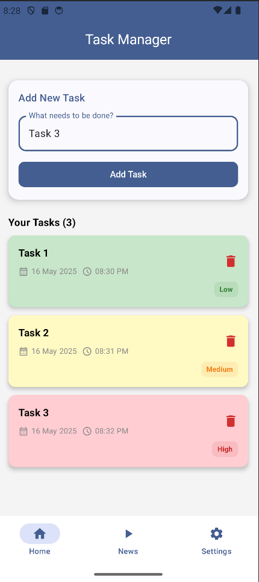

# 📋 Task Manager App (Kotlin + Jetpack Compose)

A clean and modern Task Manager Android application built using **Kotlin** and **Jetpack Compose**. This app helps users manage their daily tasks and stay updated with the latest news using a built-in news feed.

---

## 🚀 Features

### ✅ Task Management
- 📝 **Add New Tasks**  
  Create tasks with custom names, dates, and times.

- ⏰ **Scheduling**  
  Select date and time for each task to keep your day organized.

- 🏷️ **Task Priority Levels**  
  Categorize tasks by priority: High, Medium, Low – color-coded for easy recognition.

- 🗃️ **Room Database Integration**  
  Persistent local data storage using Room – your tasks stay even after closing the app.

- 🗑️ **Delete Tasks**  
  Remove tasks with one tap.

---

### 📰 News Integration
- 📡 **Fetch News Using NewsAPI**  
  The app uses [NewsAPI.org](https://newsapi.org/) to fetch real-time news headlines.

- 📰 **Dedicated News Screen**  
  Stay informed with the latest news from various categories like technology, business, and health.

- 🔄 **Live Updates**  
  Refresh button or auto-refresh for latest articles.

> ⚠️ You'll need a free API key from [https://newsapi.org](https://newsapi.org) to use the News feature.

---

### 🎨 UI & Navigation
- 💡 **Jetpack Compose UI**  
  Modern, declarative UI with Compose.

- 🌙 **Dark Mode Support**

- 🧭 **Bottom Navigation Bar**  
  Navigate between:
  - Home 🏠 (Tasks)
  - News 📰
  - Settings ⚙️

---

## 🔧 Tech Stack

- Kotlin
- Jetpack Compose
- Room Database
- Retrofit + Coroutine for News API
- Material Design 3
- MVVM Architecture
- ViewModel + State

---

---

## 📱 Requirements

- Android Studio Flamingo or later
- Android 8.0 (API 26) and above
- Kotlin 1.9+
- NewsAPI key from [https://newsapi.org](https://newsapi.org)

---

## 🧑‍💻 Author

Made with ❤️ by [Sidharth Ramachandran]  
Feel free to contribute, suggest improvements, or open issues!

---

## 📄 License

This project is open-source and available under the [MIT License](LICENSE).

